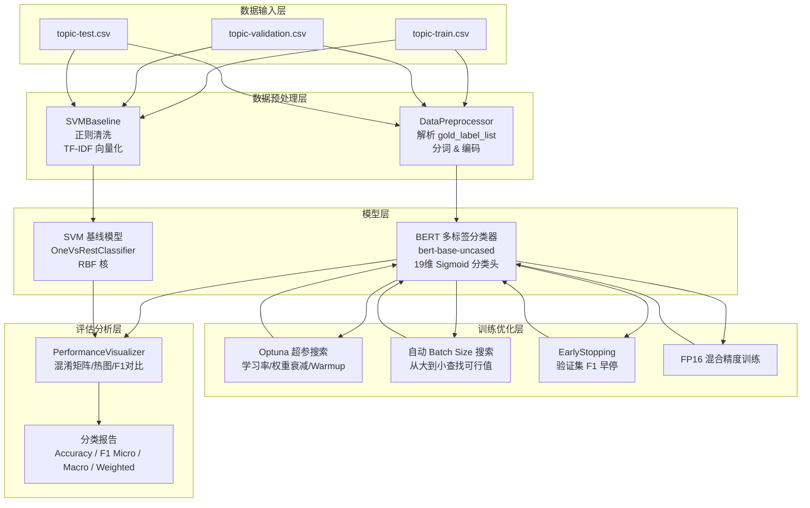
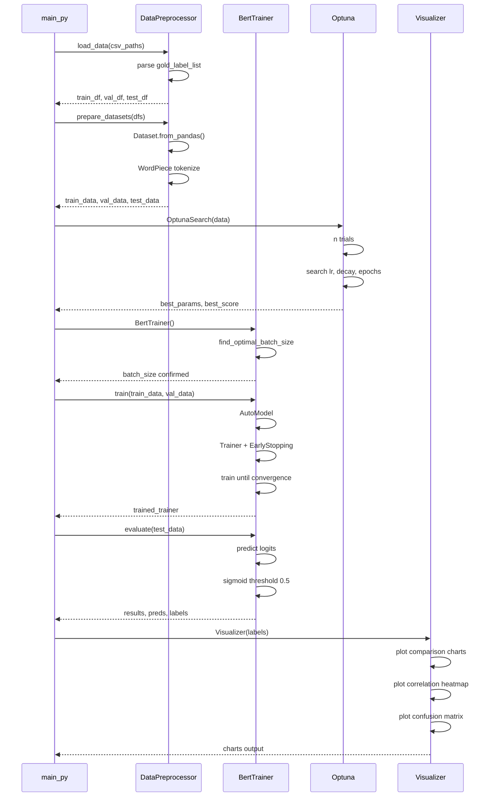
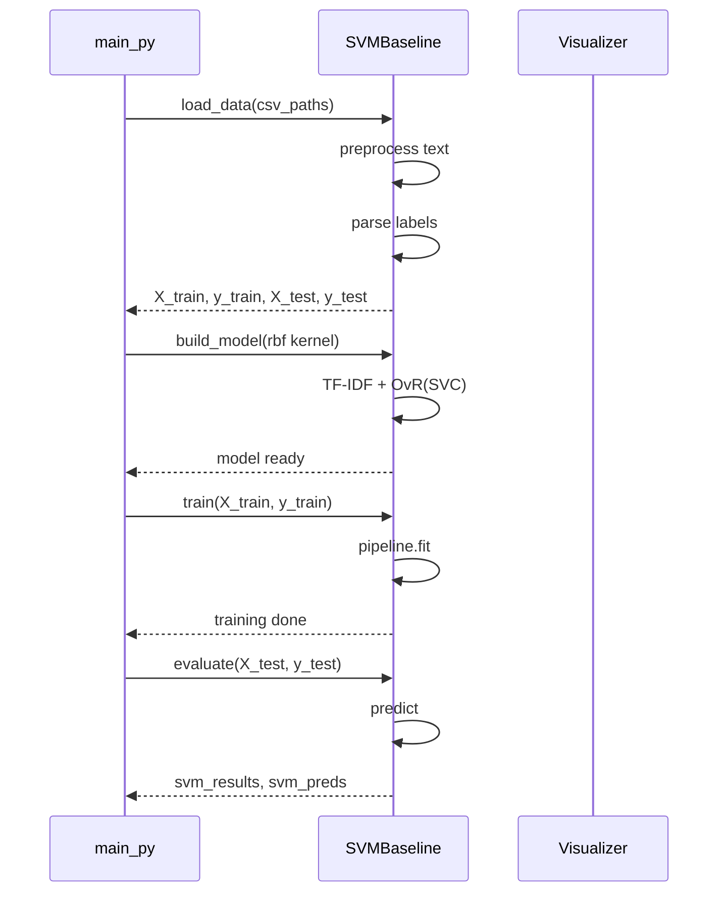

# ProjectDescription

## 项目背景

### 问题定义

社交媒体（Twitter/X）上的推文内容丰富多彩，一条推文往往涉及多个主题（如同时涉及"科技"和"音乐"）。传统的单标签分类无法准确反映这种多义性，因此需要**多标签文本分类（Multi-label Text Classification）** 技术。

### 业务价值

- 社交媒体舆情监控：实时识别推文涉及的多维度话题
- 个性化内容推荐：根据用户兴趣的多个标签精准推荐
- 趋势分析：从多维度理解社交媒体热点演变
- 品牌营销：追踪品牌相关推文的多主题分布

### 数据集

数据集来源于 Twitter 推文，共标注了 **19 个主题类别**，每条推文可能同时属于多个类别（多标签）。数据分为训练集、验证集和测试集三部分。

### 技术路线

项目实现并对比了两条技术路线：

1. **SVM 基线模型**：TF-IDF + OneVsRestClassifier + 核 SVM
2. **BERT 微调模型**：bert-base-uncased + 19维 Sigmoid 多标签分类头

---

## 系统架构图



**架构说明**：

- **数据输入层**：三个 CSV 文件分别存放训练/验证/测试集，每行包含推文文本(text)、发布日期(date)、19维标签向量(gold_label_list)
- **数据预处理层**：
  - `DataPreprocessor`：为 BERT 模型服务，使用 `AutoTokenizer` 进行 WordPiece 分词，padding 和 truncation 到固定长度 512
  - `SVMBaseline`：内建预处理流程，包含正则清洗（去除非字母字符、URL、@用户）、TF-IDF 特征提取（max_features=5000, ngram_range=(1,2)）
- **模型层**：双模型对比架构，BERT 和 SVM 并行训练与评估
- **训练优化层**：包含 Optuna 超参自动搜索、自适应 batch size 查找、EarlyStopping 早停、FP16 混合精度训练
- **评估分析层**：统一的 `PerformanceVisualizer` 生成对比图表

---

## 时序图

### BERT 训练流程



### SVM 基线流程



**时序说明**：

- BERT 训练流程包含数据预处理、可选 Optuna 超参搜索、自动 batch size 探测、Trainer 训练与 EarlyStopping、模型评估与可视化
- SVM 基线流程简洁，包含文本清洗、TF-IDF 特征提取、OneVsRestClassifier 训练、测试集评估
- 最终在 main.py 中统一对比两个模型的性能指标

---

## 图示解释

### 1. 标签相关性热图 (Label Correlation Heatmap)

- **作用**：计算 19 个标签之间在测试集上的 Pearson 相关系数，以热图形式展示
- **解读**：
  - 颜色越红（接近 +1）：两个标签经常同时出现（语义重叠）
  - 颜色越蓝（接近 -1）：两个标签互斥出现
  - 对角线为 1（自相关）
- **应用**：发现高度相关的标签对，分析语义重叠原因，辅助模型调优

### 2. 混淆矩阵 (Confusion Matrix)

- **作用**：为每个标签生成 2×2 混淆矩阵（TN/FP/FN/TP），每 3 个一组展示
- **解读**：
  - 左上（TN）：正确预测为负类
  - 右上（FP）：误报，实际无此标签却被预测有
  - 左下（FN）：漏报，实际有此标签但被遗漏
  - 右下（TP）：正确预测为正类
- **应用**：定位少数类的预测困难，分析 FP/FN 集中的类别

### 3. 各类别 F1 分数柱状图 (Class Performance)

- **作用**：展示每个标签的 binary F1 分数，以柱状图形式对比
- **解读**：柱高代表模型在该类别上的表现，差异越大说明类别不平衡问题越严重
- **应用**：识别模型表现薄弱的具体类别

### 4. 模型性能对比图 (Model Comparison)

- **作用**：BERT vs SVM 在 Accuracy / F1 Micro / F1 Macro / F1 Weighted 四个指标上的并排柱状图对比
- **解读**：直观展示 BERT 在所有指标上对比 SVM 的绝对优势
- **应用**：量化预训练语言模型相比传统方法的提升幅度

### 5. 样本数量分布图 (Sample Count per Label)

- **作用**：展示每个标签在数据集中出现的频次
- **解读**：暴露数据类别不平衡问题（如某些标签出现极少）
- **应用**：指导是否需要采用重采样或类别权重策略

---

## 解决的问题

| 问题 | 解决方案 |
|------|---------|
| **多标签分类** | 使用 19 维 Sigmoid 输出层替代 Softmax，每条推文可同时属于多个主题 |
| **类别不平衡** | 使用 Weighted F1 作为主要评估指标，少数类通过 F1 Macro 单独跟踪 |
| **训练不稳定** | EarlyStopping patience=3 防止过拟合，FP16 混合精度加速训练 |
| **OOM 问题** | 自适应 batch size 搜索（从 512 开始递减查找可行值） |
| **超参选择困难** | Optuna 自动超参搜索（TPESampler + MedianPruner 剪枝） |
| **短文本语义稀疏** | BERT 的上下文嵌入比 TF-IDF 词袋模型更好地捕捉语义 |
| **标签语义重叠** | 标签相关性热图分析重叠模式，帮助理解预测冲突 |

---

## 指标对比

| 指标 | SVM 基线 | BERT 微调 | 提升幅度 |
|------|---------|-----------|---------|
| Accuracy | — | — | — |
| F1 (Micro) | — | — | — |
| F1 (Macro) | — | — | — |
| **F1 (Weighted)** | **0.4446** | **0.7073 (典型值)** | **~59%** |

*注：具体数值以实际运行为准，表中为参考值。*

### 少数类分析（示例）

| 标签 | SVM F1 | BERT F1 | 样本数 |
|------|--------|---------|--------|
| other hobbies | 低 | 中 | <100 |
| youth & student life | 低 | 中 | <100 |
| relationships | 低 | 中 | <100 |

BERT 在多数类和少数类上均显著优于 SVM，尤其在样本稀少类别上的泛化能力更强。

---

## 优缺点

### SVM 基线

**优点**：
- 训练速度快，无需 GPU
- 可解释性强，TF-IDF 特征能直接查看关键词权重
- 在小样本场景下表现稳定
- 部署成本低，模型体积小

**缺点**：
- 无法捕捉上下文语义和一词多义
- TF-IDF 特征维度有限（5000），丢失高频词之外的信号
- 在复杂语义场景下 F1 显著低于 BERT
- 对类别不平衡敏感

### BERT 模型

**优点**：
- 利用预训练知识，上下文语义理解能力强
- F1 Weighted 可达 0.70+，比 SVM 提升约 59%
- Transformer 自注意力机制捕捉长距离依赖
- AdamW 优化器配合 Warmup 学习率调度收敛稳定

**缺点**：
- 需要 GPU 资源，训练耗时长（数小时）
- 模型参数量大（~110M），推理速度较慢
- 需要大量训练数据才能发挥优势
- 可解释性较差（黑盒模型）

---

## 未来展望

1. **模型升级**：
   - 尝试 RoBERTa、DeBERTa、XLNet 等更强预训练模型
   - 应用 LoRA / QLoRA 等参数高效微调方法降低显存需求

2. **数据增强**：
   - 使用回译（Back Translation）对少数类进行数据增强
   - 引入 EDA（Easy Data Augmentation）方法：同义词替换、随机插入/交换/删除

3. **训练优化**：
   - 引入 Focal Loss 替代 BCELoss，缓解类别不平衡
   - 使用 GradCache 等内存优化技术支持更大 batch size
   - 多任务学习：同时预测主题 + 情感

4. **工程化**：
   - 封装为 REST API 服务（FastAPI + ONNX Runtime）
   - 模型量化（INT8/FP16）加速推理
   - 添加模型版本管理和 A/B 测试能力

5. **可解释性**：
   - 集成 SHAP / LIME 进行模型解释
   - 可视化注意力权重，展示模型关注的文本区域

6. **多语言扩展**：
   - 替换为 XLM-RoBERTa 等跨语言模型
   - 支持中英文等多语言推文混合场景

---

## 函数接口定义

### DataPreprocessor

```python
class DataPreprocessor:
    def __init__(self, model_name: str = "bert-base-uncased", max_seq_len: int = 512)
        """初始化预处理器
        Args:
            model_name: 预训练模型名称，用于加载对应 tokenizer
            max_seq_len: 最大序列长度，默认 512
        """

    def load_data(self, train_path: str, val_path: str, test_path: str)
        -> tuple[pd.DataFrame, pd.DataFrame, pd.DataFrame]
        """加载三个 CSV 数据集，解析 gold_label_list 为 float 列表
        Args:
            train_path: 训练集 CSV 路径
            val_path:   验证集 CSV 路径
            test_path:  测试集 CSV 路径
        Returns:
            (train_df, val_df, test_df): 各包含 'labels' 列（float list）
        """

    def tokenize_function(self, examples: dict) -> dict
        """对文本进行 BERT 分词
        Args:
            examples: 包含 'text' 键的 dict（HuggingFace Dataset 格式）
        Returns:
            {'input_ids': ..., 'attention_mask': ...} 分词结果
        """

    def prepare_datasets(self, train_df, val_df, test_df)
        -> tuple[Dataset, Dataset, Dataset]
        """将 DataFrame 转为 HuggingFace Dataset 并进行分词
        Returns:
            (tokenized_train, tokenized_val, tokenized_test): PyTorch 格式数据集
        """
```

### BertMultilabelClassifier

```python
class BertMultilabelClassifier(nn.Module):
    def __init__(self, model_name: str = "bert-base-uncased",
                 num_labels: int = 19,
                 dropout_rate: float = 0.1)
        """BERT 多标签分类器
        Args:
            model_name:  预训练 BERT 模型名称
            num_labels:  标签数量（默认 19）
            dropout_rate: Dropout 比率
        """

    def forward(self, input_ids, attention_mask, token_type_ids=None, labels=None)
        -> tuple[Tensor, Tensor] | Tensor
        """前向传播
        Args:
            input_ids:      token IDs [batch_size, seq_len]
            attention_mask: 注意力掩码 [batch_size, seq_len]
            token_type_ids: 类型 IDs（可选）
            labels:         真实标签 [batch_size, num_labels]（训练时提供）
        Returns:
            训练时返回 (loss, probabilities)，推理时返回 probabilities
        """
```

### BertTrainer

```python
class BertTrainer:
    def __init__(self, model_name: str = "bert-base-uncased", num_labels: int = 19)
        """BERT 训练器
        Args:
            model_name: 预训练模型名称
            num_labels: 标签数量
        """

    def _compute_metrics(self, eval_pred: EvalPrediction) -> dict
        """评估指标计算
        Returns:
            {'accuracy', 'f1_micro', 'f1_macro', 'f1_weighted'}
        """

    def find_optimal_batch_size(self, train_data: Dataset) -> int
        """自动查找最大可行 batch size（从 512 递减探测，避免 OOM）
        Returns:
            可行的最大 batch size
        """

    def train(self, train_data: Dataset, val_data: Dataset,
              params: dict | None = None) -> Trainer
        """训练 BERT 模型
        Args:
            train_data: 训练集
            val_data:   验证集
            params:     参数字典，支持 learning_rate, weight_decay,
                        num_train_epochs, warmup_ratio, per_device_train_batch_size
        Returns:
            训练好的 HuggingFace Trainer 对象
        """

    def evaluate(self, trainer: Trainer, test_data: Dataset, test_df: pd.DataFrame)
        -> tuple[dict, np.ndarray, np.ndarray]
        """在测试集上评估模型
        Returns:
            (metrics_dict, binary_predictions, true_labels)
            metrics_dict: {'accuracy', 'f1_micro', 'f1_macro', 'f1_weighted'}
            binary_predictions: (n_samples, 19) 二值预测
            true_labels: (n_samples, 19) 真实标签
        """
```

### SVMBaseline

```python
class SVMBaseline:
    def __init__(self)
        """SVM 基线模型初始化"""

    def _preprocess(self, text: str) -> str
        """文本预处理：去除非字母字符、去除 URL/@用户、转小写
        Args:
            text: 原始推文文本
        Returns:
            清洗后的文本
        """

    def load_data(self, train_path: str, val_path: str, test_path: str)
        -> tuple[np.ndarray, np.ndarray, np.ndarray, np.ndarray, np.ndarray, np.ndarray]
        """加载并预处理数据
        Returns:
            (X_train, y_train, X_val, y_val, X_test, y_test)
        """

    def build_model(self, kernel: str = 'rbf', C: float = 1.0,
                    gamma: str = 'scale', class_weight: str = 'balanced')
        """构建 TF-IDF + OneVsRestClassifier(SVC) Pipeline
        Args:
            kernel: SVM 核函数（默认 'rbf'）
            C:      正则化参数
            gamma:  核系数
            class_weight: 类别权重
        """

    def train(self, X_train: np.ndarray, y_train: np.ndarray)
        """训练 SVM 模型"""

    def predict(self, X: np.ndarray) -> np.ndarray
        """预测多标签结果"""

    def predict_proba(self, X: np.ndarray) -> np.ndarray
        """预测概率"""

    def evaluate(self, X: np.ndarray, y: np.ndarray, dataset_name: str = "")
        -> tuple[dict, np.ndarray]
        """评估模型性能
        Returns:
            (metrics_dict, y_pred)
            metrics_dict: {'accuracy', 'f1_micro', 'f1_macro', 'f1_weighted'}
        """
```

### OptunaHyperparameterSearch

```python
class OptunaHyperparameterSearch:
    def __init__(self, train_data: Dataset, val_data: Dataset, num_labels: int = 19)
        """Optuna 超参搜索器
        Args:
            train_data: 训练集
            val_data:   验证集
            num_labels: 标签数量
        """

    def objective(self, trial: optuna.Trial) -> float
        """Optuna 目标函数（Trial 内的训练评估流程）
        搜索空间:
            - learning_rate: [1e-6, 1e-4] log-uniform
            - weight_decay:  [1e-6, 1e-2] log-uniform
            - num_train_epochs: [3, 10] int
            - warmup_ratio:  [0.0, 0.2] uniform
            - per_device_train_batch_size: [8, 16, 32] categorical
        Returns:
            验证集 Weighted F1 分数
        """

    def search(self, n_trials: int = 20) -> tuple[dict, float]
        """执行超参搜索
        Args:
            n_trials: 搜索轮数
        Returns:
            (best_params, best_score)
        """
```

### PerformanceVisualizer

```python
class PerformanceVisualizer:
    def __init__(self, labels: list[str])
        """性能可视化器
        Args:
            labels: 19 个标签名称列表
        """

    def plot_confusion_matrix(self, y_true: np.ndarray, y_pred: np.ndarray,
                              model_name: str = "", save_path: str | None = None)
        """绘制混淆矩阵（每 3 个标签一组）

    def plot_label_correlation_heatmap(self, y_true: np.ndarray,
                                        y_pred: np.ndarray | None = None,
                                        save_path: str | None = None)
        """绘制标签相关性热图"""

    def plot_class_performance(self, y_true: np.ndarray, y_pred: np.ndarray,
                                model_name: str = "", save_path: str | None = None)
        -> list[float]
        """绘制各类别 F1 分数柱状图
        Returns:
            每个标签的 F1 分数列表
        """

    def plot_model_comparison(self, bert_results: dict, svm_results: dict,
                               save_path: str | None = None)
        """绘制模型性能对比图（Accuracy / F1 Micro / F1 Macro / F1 Weighted）

    def plot_sample_count_per_label(self, y_true: np.ndarray,
                                     save_path: str | None = None)
        -> np.ndarray
        """绘制每个标签的样本数量分布
        Returns:
            每个标签的样本计数
        """
```
